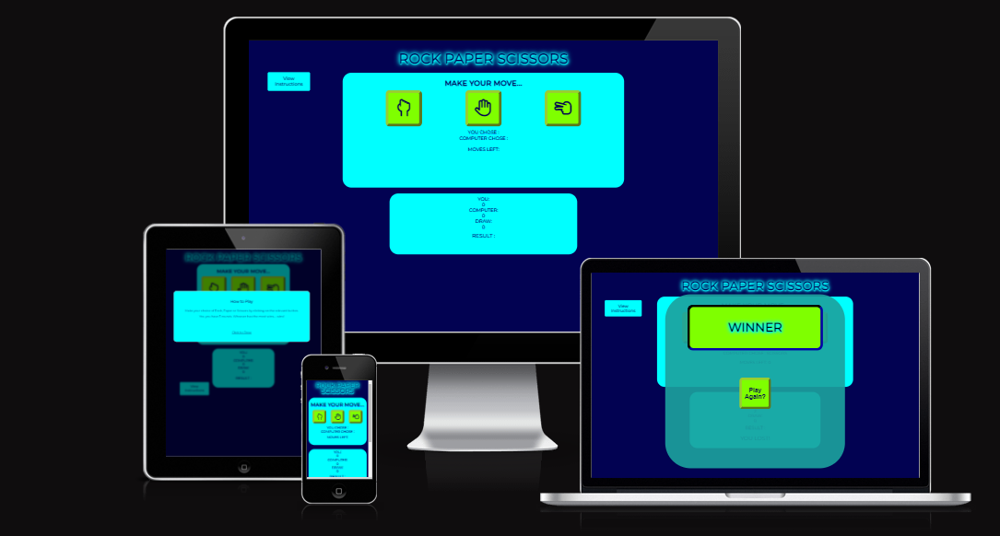
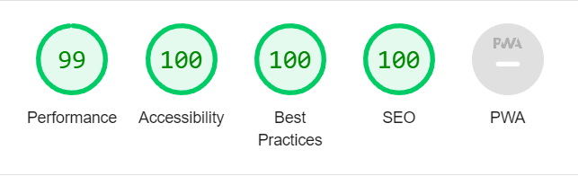

# Rock Paper Scissors

[Rock Paper Scissors](https://markdaniel1982.github.io/RPS_PP2/) - View live page
_____
## Key Project Goals

### Site Owner
  * Provide a game where the user can play against the computer.
  * Show a count of the number of games left in the round.
  * after 5 games, calculate and display whether the player won or lost

### Site Users
  * To easily understand how to start playing
  * Get feedback in the form of on screen display of which move was chosen by the user and computer
  * To see who was the winner of the 5 rounds

_______

## Wireframes

* Mobile

___

* Tablet

___

* Desktop

_______
## Design, Features and Theme

I used contrasting colours of aqua and a dark blue (rgb (2, 2, 82)) for the main sections of the page and chartreuse for the buttons.

### Main Page

There is only one page in this project which shows a header with the game title of Rock Paper Scissors. Underneath the header are two sections. The first is the game area showing three buttons, each with an icon of each available option. Below the buttons, the choices made by the user and the computer are displayed.

The second section shows the the total number of round wins, which counts from 0 up to 5 and the result of that round. Below that is the number of rounds left in that game.
____

## Testing
### HTML
The HTML was validated using https://validator.w3.org/

### CSS
the CSS was validated using https://jigsaw.w3.org/css-validator/

### javaScript
The javaScript was validated using https://jshint.com/
The only issues here were some semicolons missing, which have now been added.

### Responsivity
The site's responsivity was tested using DevTools in Google Chrome. Media queries have been set for tablets and mobile devices (see image at top of readme)
_____

### Lighthouse
* Desktop

* Mobile

___

### Errors & Debugging

Once the game function was built (see code credits), I had issues trying to get the game counters, what selection was made and the result to display correctly. I sought help from a Slack user (Tony Albanese). He made suggestions to help tidy the code and get things into the correct order and scope so that each function was able to perform its tasks.

#### Unresolved Bugs

There are no unresolved bugs

_______

## Deployment

The site was created in gitpod, and pushed to github to make it publicly accessible using the following commands in the terminal:

  * git add .
  * git commit -m "Description of updates since last commit"
  * git push

  Then, in Github, select the Repository > Settings > Pages. Then, under "Build and deployment" Select the required branch to publish from the dropdown menu, and Save.
  Once the updates have been pushed from Gitpod, they will show on the deployed page, usually after a minute or two.
_____

## Credits

Game layout - I took the main code structure from here, but as it is a very simple version, I added in extra features of displaying selection made each round, a count of the wins/losses/draws and calculating and displaying the overall winner - https://www.geeksforgeeks.org/rock-paper-and-scissor-game-using-javascript/

Also, a very big thank you to Slack user Tony Albanese who helped point me in the right direction when I was unable to correctly code the round countdown and overall winner.

### Code

CI Love Maths walkthrough (dom content loaded)

Overlay popup (used but amended in places to suit my project)- https://findnerd.com/list/view/How-to-make-simple-Overlay-popup-/1966/

### Fonts and Icons 
 
* Fonts from Google fonts
* Icons from Fontawesome